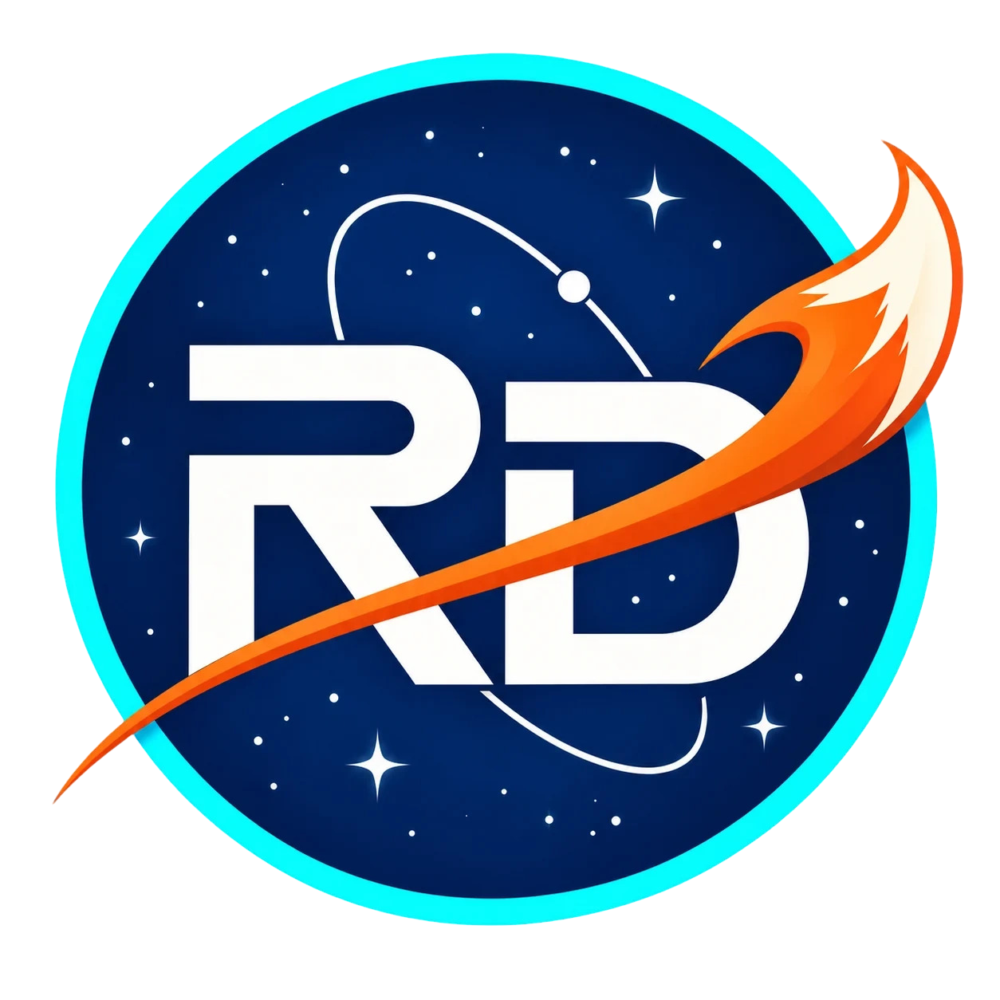

  

<h1 align="center">RSL Drafter</h1>

  <a href="https://rsldrafter.app">Website</a> ·
  <a href="https://rsldrafter.app/beta-application">Apply for beta access</a> ·
  <a href="https://discord.gg/Nzm5487Ncz">Discord community</a>

RSL Drafter is a Windows bot for RAID: Shadow Legends Live Arena. It runs a Preset Lineup that you configure: five champion slots, ordered substitutes, draft priorities and supported Battle Openers. You review the setup and explicitly start each bounded session.

This repository provides product information and release downloads. The application source code is not published here.

## Public beta

- **Current build:** [RSL Drafter 0.1.2](https://github.com/Nanaconda38/RSL-Drafter/releases/tag/v0.1.2)
- **Platform:** Windows x64
- **Supported game build:** RAID: Shadow Legends 11.75.0
- **Download:** Public on the GitHub Releases page.
- **App access:** Applications are reviewed by a person. Verify your email, then wait for the decision. If approved, a single-use invitation lets you create an account. An approved account and access grant are required to use the app.

## What the bot does

1. **Build a five-champion lineup.** Choose a primary for each slot, order substitutes and link fallback slots.
2. **Set draft priorities.** Configure Pick Rules, ban priorities, leader order and supported Battle Openers.
3. **Run a bounded Live Arena session.** Review the plan and session limits, connect to RAID, then explicitly start.

The current public release supports **Preset Lineup for Live Arena only**. Adaptive Draft and Classic Arena are not available. RSL Drafter does not promise a win or choose a meta team for you.

## Download and get started

1. Download the Windows installer from the [v0.1.2 release page](https://github.com/Nanaconda38/RSL-Drafter/releases/tag/v0.1.2) and read its release notes.
2. [Apply for beta access](https://rsldrafter.app/beta-application) and verify your email.
3. If your application is approved, use the single-use invitation to choose a username and create your account.
4. Open RSL Drafter and choose **Sign in**. Enter your username or email and the password you set through the invitation.
5. Return to the app, launch RAID if needed, connect, review your Preset Lineup and session limits, then explicitly start Live Arena.

[Open the illustrated setup guide](https://rsldrafter.app/beta-get-started).

Never share your password or invitation link. Applying does not create an account or grant app access.

## Data and updates

Public build 0.1.2 does not upload match telemetry to an RSL Drafter server. Account sign-in, access checks and downloads are separate services. See the [data notice](https://rsldrafter.app/data-notice) for application and account details.

Check the [GitHub Releases page](https://github.com/Nanaconda38/RSL-Drafter/releases) for updates and download them manually. The in-app update feed is not configured as the source for this public release.

## Reporting a problem

Before opening an issue, check the release notes and existing issues. Include:

- RSL Drafter version;
- RAID build;
- what you were doing;
- what you expected and what happened.

Do not post passwords, tokens, account details or unreviewed diagnostic files. Review any diagnostic report before attaching it.

[Open an issue](https://github.com/Nanaconda38/RSL-Drafter/issues)

## Disclaimer

RSL Drafter is an independent community project. It is not affiliated with, endorsed by or sponsored by Plarium. RAID: Shadow Legends and related marks belong to their respective owners.

## License

All rights reserved. See [LICENSE](LICENSE). No open-source license is granted for this repository or the application releases.
